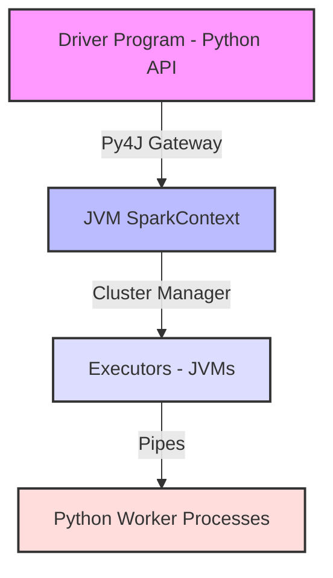

# Chapter 5: Distributed Data Processing with PySpark

> **Part:** Python for Data Engineering
>
> **Chapter:** 5
>
> **Difficulty:** 🔴 Advanced
>
> **Estimated Reading Time:** 55–70 minutes
>
> **Prerequisites:** Chapters 1–4, basic SQL
>
> **Target Audience:** Data Engineers, Spark Developers, Platform Engineers
>
> **Version:** 2.0
>
> **Last Updated:** 2026-07-06

---

# Learning Objectives

After completing this chapter, you will be able to:
- Explain Spark's internal execution engine, detailing the **Catalyst Optimizer** stages and **Tungsten** memory optimizations.
- Demystify the **Shuffle Phase** and configure partition settings to prevent network bottlenecks.
- Troubleshoot and fix **Out-Of-Memory (OOM)** exceptions on drivers and executors.
- Mitigate partition skew using **key salting** techniques.
- Programmatically construct PySpark DataFrames, defining schemas using `StructType` and `StructField`.
- Apply Spark SQL queries and DataFrame API transformations to ingest and analyze large datasets.
- Optimize PySpark jobs using Broadcast Joins, custom partitioning, and appropriate caching levels.
- Implement analytical window functions for ranking and sequential aggregation.
- Differentiate between PySpark UDFs and Vectorized/Pandas UDFs to avoid serialization bottlenecks.

---

# Quick Revision

- **Driver Node:** Coordinates execution, runs `main()`, translates code into tasks, and tracks executor statuses.
- **Executor Nodes:** Processes tasks assigned by the Driver, storing data in RAM or local disk.
- **Lazy Evaluation:** Spark does not compute transformations immediately. It plans them into a DAG (lineage) and executes them only when an **Action** is called.
- **Transformations:** Operations that return a new DataFrame (e.g., `filter()`, `select()`, `join()`). Can be narrow or wide.
- **Actions:** Operations that trigger computation and return results to the driver or write to storage (e.g., `count()`, `collect()`, `save()`).
- **Catalyst Optimizer:** Spark's query optimizer that translates code into optimized physical execution plans.
- **Tungsten Engine:** Optimizes physical execution by managing JVM memory directly, avoiding JVM garbage collection overhead.
- **Data Skew:** An uneven distribution of data across partitions, causing a single executor to process the majority of the dataset while others sit idle.
- **Broadcast Join:** Replicates a small DataFrame to all executors, completely bypassing expensive network shuffles during joins.

---

# Spark Architecture & The Catalyst/Tungsten Engines

Apache Spark is a distributed computing engine. Because Spark is written in Scala (running on the JVM), PySpark utilizes a library called **Py4J** to bridge the gap.



## 1. Under the Hood: Catalyst Optimizer
When you write Spark SQL or DataFrame operations, the **Catalyst Optimizer** translates your code into an optimized execution plan through four distinct stages:

```text
User Code 
   ↓
[1. Analysis] ───────→ Resolves table/column names against Catalog/Metastore
   ↓
[2. Logical Plan] ───→ Applies optimization rules (e.g. filter pushdown, constant folding)
   ↓
[3. Physical Plan] ──→ Generates multiple physical plans, cost model selects the best one
   ↓
[4. Code Generation] → Compiles bytecode dynamically at runtime (Java source generated)
```

- **Filter Pushdown:** If you write `df.load().filter(col("id") == 5)`, Catalyst pushes the filter directly to the storage layer, loading only the matching rows instead of the entire dataset.

## 2. Tungsten Execution Engine
Tungsten manages memory directly at the byte level using off-heap memory allocations (`sun.misc.Unsafe`), avoiding the overhead of JVM objects and garbage collection. It also uses cache-aware computation to keep operations entirely inside CPU registers.

---

# The Shuffle Phase Deep-Dive

A **Shuffle** is the process of redistributing data across partitions on different executors. It is triggered by wide transformations like `groupBy()`, `join()`, and `distinct()`.

### Why Shuffling is Slow:
1. **Disk I/O:** Executors must write intermediate shuffle partitions to local disk.
2. **Network I/O:** Data is sent across the network to the executors processing the target keys.
3. **Serialization:** Objects must be serialized to bytes before transmission, and deserialized on the receiving end.

```python
# Default partition count for shuffle operations is 200
# spark.conf.set("spark.sql.shuffle.partitions", "200")
```
- **The Bottleneck:** If you process a small 10MB dataset with the default setting, Spark splits the data into 200 partitions, creating massive scheduling overhead. Conversely, if you process a 1TB dataset, 200 partitions is too few, and each partition will be too large to fit in executor memory, causing disk spill or OOM crashes.
- **Rule of Thumb:** Aim for partition sizes between **100MB and 200MB** in memory. Adjust `spark.sql.shuffle.partitions` dynamically depending on the dataset size.

---

# Troubleshooting OOM & Data Skew

## 1. Fixing Out-Of-Memory (OOM) Errors
OOM errors occur on either the Driver or Executors:
- **Driver OOM:** Caused by calling `.collect()` on a massive dataset, pulling all rows from executors into the driver's memory.
  - *The Fix:* Avoid `collect()` in production. Use `.write` to save results directly to storage, or use `.take(n)` to inspect only a few rows.
- **Executor OOM:** Caused by partition sizes that exceed executor memory limits, or by memory leaks inside custom Python UDFs.
  - *The Fix:* Increase executor memory, adjust partition counts, or avoid Python UDFs.

## 2. Mitigating Data Skew via Key Salting
Data skew happens when a specific key (e.g. `country = 'US'`) has significantly more rows than other keys. The executor handling the 'US' partition will take much longer to finish, leaving other executors idle (the "straggler" effect).

**The Solution: Key Salting**
Append a random integer suffix (e.g., `0` to `N-1`) to the join key of the skewed table, and replicate the lookup rows in the dimension table to match these salted keys, distributing the load evenly across executors.

```python
from pyspark.sql.functions import col, concat, lit, rand, explode, array

# Skewed transactions dataset
skewed_tx_df = spark.read.parquet("s3://data/transactions/")

# Salt the transaction join key: append random suffix "0" to "3"
salted_tx_df = skewed_tx_df.withColumn(
    "salted_join_key", 
    concat(col("user_id"), lit("_"), (rand() * 4).cast("int"))
)

# Small users metadata lookup table
users_df = spark.read.parquet("s3://data/users/")

# Replicate users rows 4 times to match salted keys
replicated_users_df = users_df.withColumn(
    "salt_array", 
    array([lit(i) for i in range(4)])
).withColumn("salt", explode(col("salt_array"))) \
 .withColumn("salted_join_key", concat(col("user_id"), lit("_"), col("salt")))

# Perform join on salted keys: data is balanced across partitions
balanced_joined_df = salted_tx_df.join(
    replicated_users_df, 
    on="salted_join_key", 
    how="inner"
)
```

---

# Core Concepts: Lineage, Lazy Evaluation & DAGs

### Transformations vs. Actions
- **Narrow Transformations:** Work on single partitions. No data needs to be moved across executors (e.g., `select()`, `filter()`, `map()`).
- **Wide Transformations (Shuffles):** Require data to be redistributed across partitions on different executors (e.g., `groupBy()`, `join()`, `distinct()`). Shuffles are slow because they write temporary files to disk and send data over the network.
- **Actions:** Trigger the actual computation (e.g., `show()`, `collect()`, `write()`).

```python
# Lazy: No execution occurs yet, Spark just registers the read schema
df = spark.read.parquet("s3://logs/raw_events/")

# Lazy: Narrow transformations added to execution plan
filtered_df = df.filter(df["status"] == "ERROR").select("user_id", "timestamp")

# Eager Action: Triggers the Spark Job, executes the DAG, and prints results
filtered_df.show(5)
```

---

# PySpark DataFrame API & Spark SQL

## 1. Defining Explicit Schemas
Explicitly defining schemas is best practice in production. It prevents schema drift and avoids reading entire files just to infer types.

```python
from pyspark.sql.types import StructType, StructField, StringType, IntegerType, DoubleType

schema = StructType([
    StructField("transaction_id", StringType(), False),
    StructField("user_id", IntegerType(), True),
    StructField("amount", DoubleType(), True),
    StructField("timestamp", StringType(), True)
])

df = spark.read.format("csv") \
    .option("header", "true") \
    .schema(schema) \
    .load("s3://transactions/*.csv")
```

## 2. DataFrame APIs & Spark SQL
You can transform data using DataFrame APIs or run SQL queries directly by creating a temporary view.

```python
# DataFrame API Approach
api_df = df.filter(df["amount"] > 100.0) \
    .groupBy("user_id") \
    .sum("amount")

# SQL Approach
df.createOrReplaceTempView("transactions")
sql_df = spark.sql("""
    SELECT user_id, SUM(amount) as total_amount
    FROM transactions
    WHERE amount > 100.0
    GROUP BY user_id
""")
```

---

# Performance Tuning & Optimizations

## 1. Broadcast Joins
When joining a large table with a small lookup table, standard joins shuffle data from both tables across the network. A **Broadcast Join** sends the entire small table to every executor, avoiding the shuffle step entirely.

```python
from pyspark.sql.functions import broadcast

# Large transaction log (Millions of rows)
tx_df = spark.read.parquet("s3://data/transactions/")

# Small region lookup table (50 rows)
regions_df = spark.read.json("s3://data/regions/")

# Broadcast join: Shuffling is prevented for tx_df
joined_df = tx_df.join(broadcast(regions_df), "region_id", "inner")
```

## 2. Partitioning vs. Coalescing
Managing partition counts is key to preventing "small file problems" and resource starvation.
- **`repartition(n)`:** Shuffles all data across the network to create exactly $n$ equally-sized partitions. Can increase or decrease partitions.
- **`coalesce(n)`:** Decreases the partition count *without* triggering a full shuffle by merging adjacent partitions.

```python
# Repartitioning before a join to ensure balanced work
balanced_df = tx_df.repartition(10, "region_id")

# Coalescing to 1 partition before writing a single output CSV
balanced_df.coalesce(1).write.csv("s3://reports/sales_summary/")
```

## 3. Caching & Persistence
If you plan to reuse a DataFrame multiple times in your script, cache it to avoid recalculating its lineage from scratch.
- `cache()`: Saves data in memory with a default storage level (`MEMORY_AND_DISK`).
- `persist(storageLevel)`: Allows customizing where data is stored (e.g. memory-only, disk-only, or replicated).

```python
# Cache intermediate transformed DataFrame
joined_df.cache()

# Action 1: Count trigger
print(joined_df.count())

# Action 2: Write trigger (reads directly from cache instead of re-reading raw files)
joined_df.write.parquet("s3://warehouse/processed/")

# Crucial: Release cache once done
joined_df.unpersist()
```

---

# Advanced PySpark: Window Functions & UDFs

## 1. Window Functions
Window functions compute results over a group of rows (the "window") without collapsing them into a single row.

```python
from pyspark.sql.window import Window
from pyspark.sql.functions import col, row_number, desc

# Define partition window: group by user, ordered by transaction date
user_window = Window.partitionBy("user_id").orderBy(desc("timestamp"))

# Rank transactions per user to find their most recent transaction
ranked_df = df.withColumn("rank", row_number().over(user_window))

# Filter to get only the latest transaction for each user
latest_tx_df = ranked_df.filter(col("rank") == 1)
```

## 2. User-Defined Functions (UDFs): Performance Traps
Standard Python UDFs run slowly because Spark has to serialize data out of the JVM to run it in Python processes. 
To write custom functions efficiently:
1. Try to use built-in **`pyspark.sql.functions`** first (they run natively inside the JVM).
2. If custom logic is required, use **Pandas UDFs** (Vectorized UDFs). Under the hood, they use Apache Arrow to transfer data in high-speed binary batches, applying vectorized operations using Pandas.

```python
from pyspark.sql.functions import pandas_udf
import pandas as pd

# Define a Pandas UDF (Series to Series transformation)
@pandas_udf("double")
def calculate_tax_vectorized(amount: pd.Series) -> pd.Series:
    return amount * 0.15

# Applying vectorized UDF
tax_applied_df = df.withColumn("tax", calculate_tax_vectorized(col("amount")))
```

---

# Exercises & Quiz

### Question 1
How does Catalyst's "Filter Pushdown" optimization improve execution performance?
- A) It deletes columns before writing to disk.
- B) It compiles code into C++.
- C) It pushes filter operations down to the storage layer, loading only the matching rows instead of the entire dataset.
- D) It bypasses network shuffles.

*Answer:* **C**. Filter pushdown minimizes disk reads and network transfers by applying filters directly at the storage level.

### Question 2
What is the primary cause of a Driver Out-Of-Memory (OOM) exception?
- A) Writing files in Parquet format.
- B) Calling `.collect()` on a large dataset, pulling all executor records into the driver's memory.
- C) Using the `coalesce` command.
- D) Replicating tables using Broadcast joins.

*Answer:* **B**. Calling `.collect()` pulls all distributed executor rows into the driver node, easily exceeding its memory limits.

---

# Chapter Summary Checklist
- Can you list the four execution optimization stages of Catalyst?
- How does the default partition count (`200`) affect performance on small datasets?
- How do you resolve executor OOM errors during shuffles?
- What is key salting, and when should you implement it?
